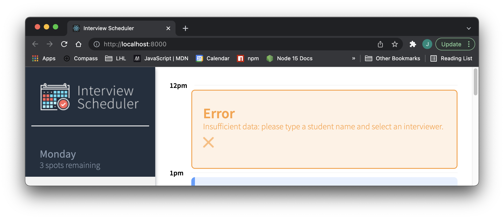

# Interview Scheduler

## A React App providing Scheduling Functionality
This project was part of the React module within the web development bootcamp at Lighthouse Labs. Backend and design were provided, the student focus was on implemententing the frontend logic (React) and understanding React concepts.

Schedule students with interviewers on a browser frontend, with real-time/multi-user update capability, using websockets.

Select a week day to see its appointments:


Type a student name and select an interviewer on the appointment form:


Confirm the cancellation of an interview:


Receive an error when trying to submit an incomplete form:



## Setup

Install dependencies with `npm install`.

## Running Webpack Development Server

```sh
npm start
```

## Running Jest Test Framework

```sh
npm test
```

## Running Storybook Visual Testbed

```sh
npm run storybook
```
